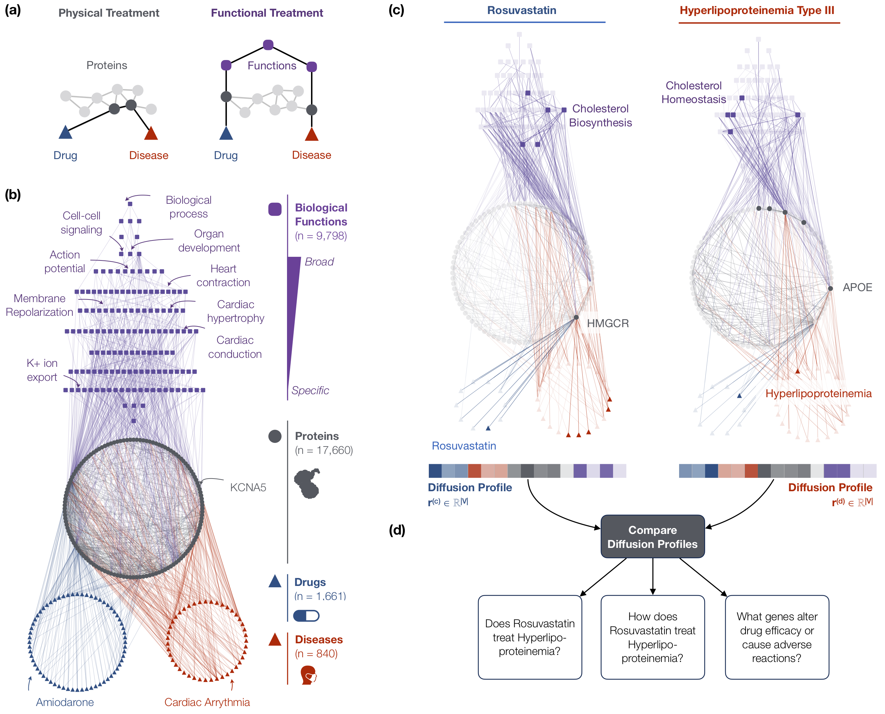

# Discovery of disease treatment mechanisms through the multiscale interactome

## Overview
<p align="center">

</p>

**The multiscale interactome is a powerful approach for the discovery of disease treatment mechanisms.** **(a)** The multiscale interactome models drug-disease treatments by integrating drugs, diseases, proteins, and functional pathways. **(b)** The diffusion profile of a drug or disease captures its effect on every protein and functional pathway. **(c)** By comparing the diffusion profiles of a drug and a disease, the multiscale interactome predicts whether the drug treats the disease, explains how the drug treats the disease, and explains how mutations interfere with the treatment mechanism to cause drug resistance or dangerous adverse reactions.

For a detailed description of the multiscale interactome and its applications, please refer to our preprint [Discovery of disease treatment mechanisms through the multiscale interactome](https://www.biorxiv.org/content/10.1101/2020.04.30.069690v1) (2020).

## Data
All data is available at http://snap.stanford.edu/multiscale-interactome/data/data.tar.gz. To download the data, please run the following code in the same directory this project is cloned to. This should result in a data/ folder populated with the relevant data.
```
wget http://snap.stanford.edu/multiscale-interactome/data/data.tar.gz
tar -xvf data.tar.gz
```

## Setup
Code is written in Python3. Please install the packages present in the requirements.txt file. You may use:
```
pip install -r requirements.txt
```

## Using the multiscale interactome
Sample code to construct the multiscale interactome and compute diffusion profiles is provided in main.ipynb.

To construct the multiscale interactome:
```
msi = MSI()
msi.load()
```

To calculate diffusion profiles with optimized edge weights, use the code below. Note that our implementation is parallelized and you will need to explicitly set the number of cores under num_cores.
```
dp = DiffusionProfiles(alpha = 0.8595436247434408, max_iter = 1000, tol = 1e-06, weights = {'down_functional_pathway': 4.4863053901688685, 'indication': 3.541889556309463, 'functional_pathway': 6.583155399238509, 'up_functional_pathway': 2.09685000906964, 'protein': 4.396695660380823, 'drug': 3.2071696595616364}, num_cores = int(multiprocessing.cpu_count()/2) - 4, save_load_file_path = "results/")

dp.calculate_diffusion_profiles(msi)
```

To load saved diffusion profiles, use:
```
dp_saved = DiffusionProfiles(alpha = None, max_iter = None, tol = None, weights = None, num_cores = None, save_load_file_path = "results/")

msi.load_saved_node_idx_mapping_and_nodelist(dp_saved.save_load_file_path)
dp_saved.load_diffusion_profiles(msi.drugs_in_graph + msi.indications_in_graph)
```

To view a diffusion profile, use:
```
# Diffusion profile for Rosuvastatin (DB01098)
dp_saved.drug_or_indication2diffusion_profile["DB01098"]
```

## Datasets
All data is provided at http://snap.stanford.edu/multiscale-interactome/data/data.tar.gz and includes:
1. Supplementary dataset of interactions between drugs and proteins
2. Supplementary dataset of interactions between diseases and proteins
3. Supplementary dataset of interactions between proteins and proteins
4. Supplementary dataset of interactions between proteins and functional pathways
5. Supplementary dataset of hierarchy of interactions between functional pathways
6. Supplementary dataset of approved drug-disease pairs
7. Supplementary dataset of drug classes according to Anatomical Therapeutic Chemical Classification
8. Supplementary dataset of selected gene expression signatures from the Broad Connectivity Map
9. Supplementary dataset of genetic mutations that alter drug response from PharmGKB
10. Supplementary dataset of optimized diffusion profiles

## Contact
Please contact Camilo Ruiz (caruiz@cs.stanford.edu) with any questions.

## Citation
```
@article{ruiz2020discovery,
  title={Discovery of disease treatment mechanisms through the multiscale interactome},
  author={Ruiz, Camilo and Zitnik, Marinka and Leskovec, Jure},
  journal={bioRxiv},
  year={2020},
  publisher={Cold Spring Harbor Laboratory}
}
``
`
